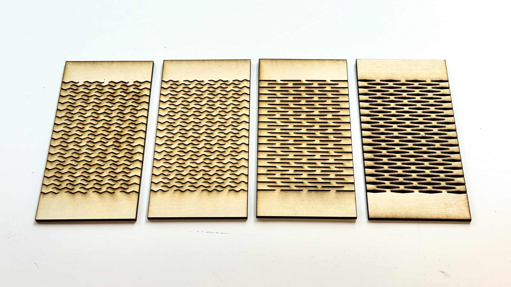

# Kerf Bending Pattern Generator

[ [Open Generator](https://jackbdu.com/kerf-bending-pattern-generator/) \| [Open in p5.js Web Editor](https://editor.p5js.org/jackbdu/sketches/73gmSBBoS) ]

A [p5.js](https://p5js.org/)-friendly customizable kerf bending pattern generator for laser cutting and engraving.



## Customization

The easiest way to design your own custom pattern is to [open the generator sketch in p5.js Web Editor](https://editor.p5js.org/jackbdu/sketches/73gmSBBoS) and modify the `kerfCustom()` function in `custom.js`.

```javascript
function kerfCustom(centerX, centerY, kerfWidth, kerfHeight, direction) {
    rectMode(CENTER);
    rect(centerX, centerY, kerfWidth, kerfHeight);
}
```

This function defines an individual element of the pattern based on five parameters: `centerX`, `centerY`, `kerfWidth`, `kerfHeight`, and `direction`. The values of the first four parameters are in pixels, and the value of the last parameter is either `1` or `-1`, which alternates in the final pattern grid. If your custom design is not directional, simply ignore the last parameter (as demonstrated in the example above).

## Contribution

Feel free to share your unique design by following the same code structure in `sketch.js` and send a pull request.

## License

This project is released under the [MIT License](./LICENSE).
